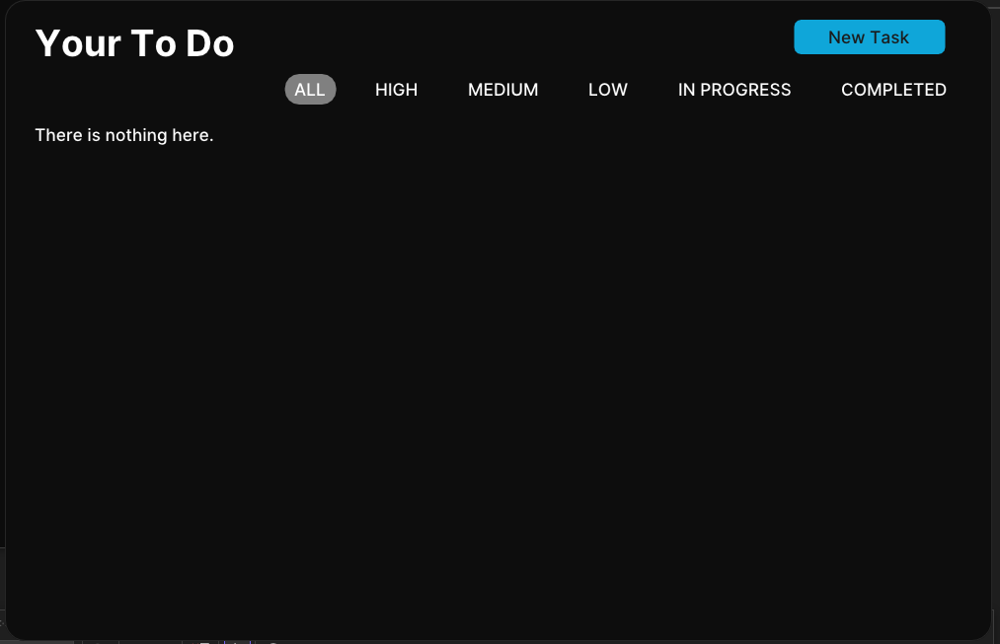
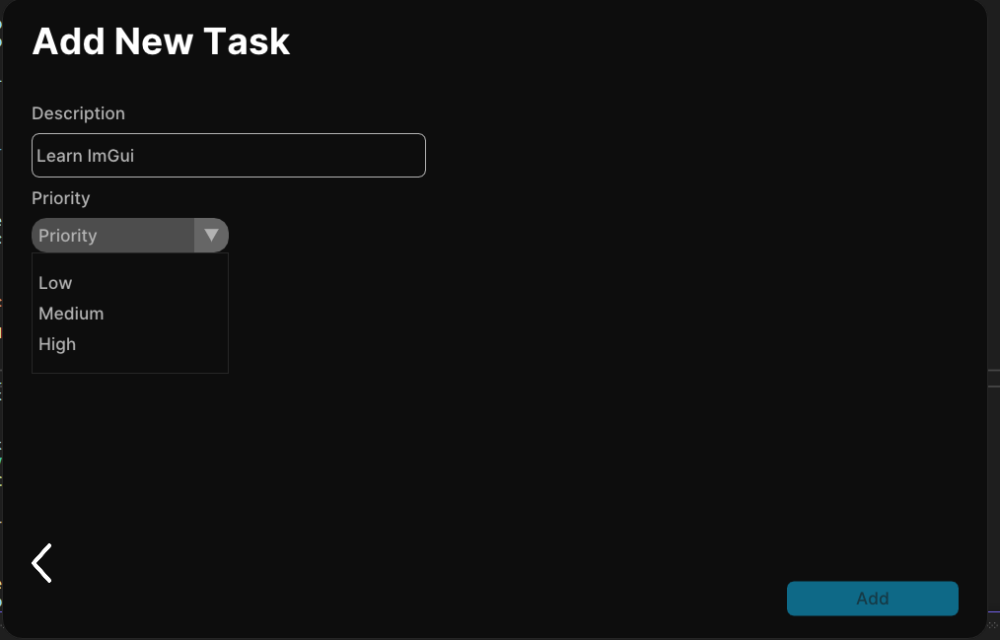
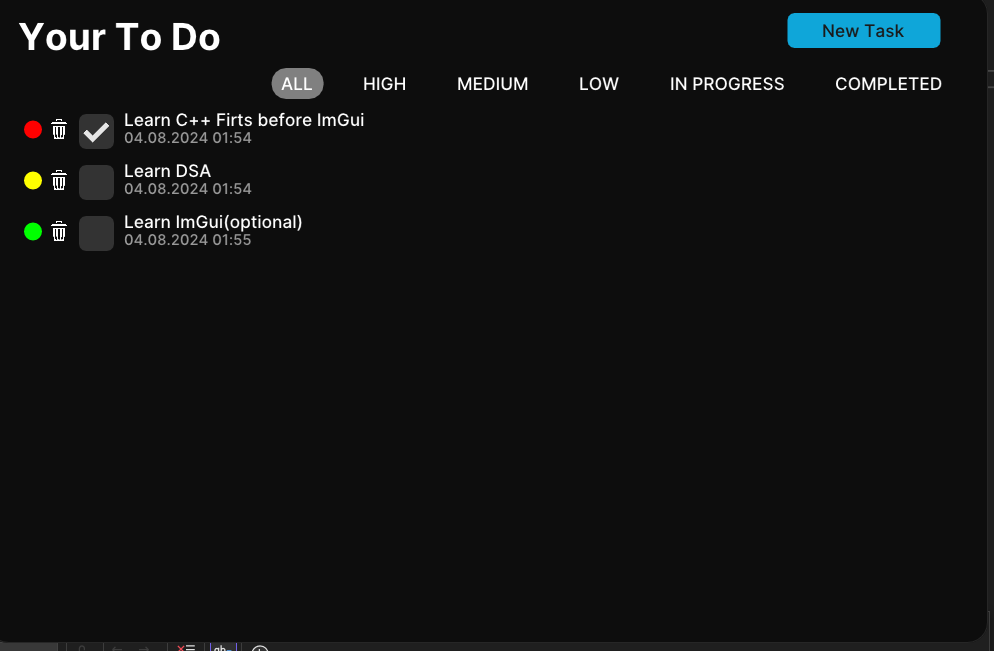

ImGui App in c++ for task management.

This is the main page of the application.

Here you can type in any task you want, just make sure you add the priority of your task!

After you described your task, you can see your task back to the main page. The red circle is the priority sign (red - high,yellow - medium, green - low).
Also the user has the ability to filter the tasks and delete them.

